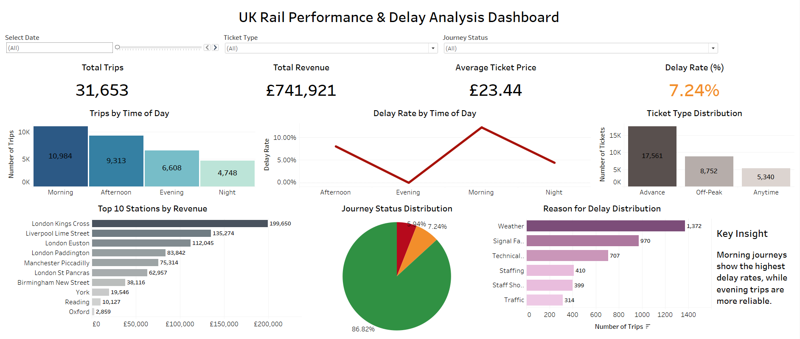

# UK Rail Performance & Delay Analysis

## Project Overview
This project analyzes UK railway ticket sales and journey performance using SQL, Python, and Tableau. The goal is to uncover insights into travel patterns, delays, and revenue trends.

---

## Objectives
- Analyze travel demand patterns across time
- Identify delay trends and peak delay periods
- Evaluate revenue distribution across stations
- Understand customer ticket preferences

---

## Tools & Technologies
- SQL (MySQL) – Data cleaning and querying  
- Python (Pandas, Matplotlib) – Data analysis and preprocessing  
- Tableau – Interactive dashboard visualization  

---

## Key Insights
- Travel demand peaks during morning and evening (commuter behavior)
- Delay rates are higher during peak hours
- A small number of stations generate the highest revenue
- Advance tickets are the most frequently purchased
- Signal failures and weather are major causes of delays

---

## Dashboard Features
- KPI Cards (Total Trips, Revenue, Avg Price, Delay Rate)
- Trips by Time of Day
- Delay Rate by Time of Day
- Revenue by Station (Top 10)
- Ticket Type Distribution
- Delay Reasons Analysis
- Interactive Filters (Date, Ticket Type, Journey Status)

---

## Dashboard Preview

---

## Dashboard
[Tableau dashboard](https://public.tableau.com/app/profile/gayathri.karagoda.pathiranage/viz/UKRailPerformanceDelayAnalysisDashboard/UKRailPerformanceDelayAnalysisDashboard)

---

## How to Use
1. Clone the repository  
2. Open the SQL files and Python files
3. Open Tableau dashboard file (.twbx or .twb)  
4. Explore the interactive dashboard  

---

## Author
Gayathri Karagoda Pathiranage  
Aspiring Data Analyst  
